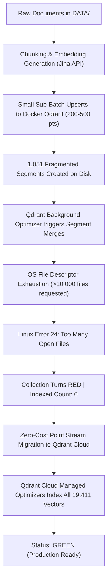

# Qdrant Failure Postmortem & Cloud Migration Architecture

## Executive Summary

During the vector database ingestion and indexing lifecycle for the Enterprise Agentic RAG system (19,411 document chunks / 1,024-dimensional vectors), the self-hosted **Docker Qdrant instance on GCP** experienced a severe failure:
- **Collection Status**: Degraded to **`RED`**
- **Indexed Vectors Count**: **`0`** (0% HNSW indexed)
- **Segment Count**: Proliferated to **`1,051 unmerged segments`**
- **Root Error**: `IO Error: failed to rename file ... Too many open files (os error 24)`

To avoid burning hundreds of thousands of LLM/Embedding API credits by re-ingesting and re-embedding raw documents from scratch, a **zero-cost point-to-point migration** was executed from GCP Docker Qdrant directly into **Qdrant Cloud**.

As a result:
- **Final Collection Status**: **`GREEN`**
- **Points Recovered**: **`19,411 / 19,411 (100%)`**
- **Indexed Vectors**: **`19,411 (100% HNSW Graph Indexed)`**
- **API Credits Spent**: **`$0 / 0 tokens`**

---

## 1. Timeline & Problem Description



---

## 2. Technical Root Cause Analysis: How & Why Docker Qdrant Failed

### A. Segment Proliferation (1,051 Segments)
In Qdrant's storage engine, each write batch and flush writes data into temporary Write-Ahead Logs (WAL) and creates individual disk-backed segments.
- During ingestion, data was upserted across multiple iterations and small sub-batches (`200–500 points`).
- Because background merging could not keep pace with write flushes, the database generated **1,051 micro-segments** across the single collection shard.

### B. File Descriptor Explosion
Each Qdrant segment is not a single file—it is a composite directory consisting of:
1. `vector.data` (mmap vector binary storage)
2. `payload/` (RocksDB / on-disk metadata store)
3. `id_map/` (ID translation table)
4. `hnsw/` (HNSW graph index layers)
5. `deleted.json` (bitset tombstones)
6. Temporary segment builder handles during optimization merges.

Each active segment requires between **10 and 15 open file handles**.
$$\text{Total Open Handles} \approx 1,051 \times 12 = \mathbf{\approx 12,600 \text{ concurrent open files}}$$

### C. OS Kernel & Container Limit Collision (`os error 24`)
Default Linux container runtimes (such as standard Docker daemons, Kubernetes pods, or standard VM configurations) enforce a soft open file descriptor limit of:
$$\text{ulimit -n} = 1024 \quad (\text{or } 4096)$$

When the background optimizer attempted to build a consolidated segment and rename it:
```
Service runtime error: IO Error: failed to rename file from 
/qdrant/./storage/collections/enterprise_rag_v1/0/temp_segments/segment_builder_mF7Hmh 
to ./storage/collections/enterprise_rag_v1/0/segments/8d03f541-3917-4617-8c0f-a0f7347ec7cd: 
Too many open files (os error 24)
```
The Linux kernel rejected the system call. The optimizer thread crashed, the collection was flagged **`RED`**, and all background HNSW graph construction halted permanently.

---

## 3. Why Re-Ingestion Was Not An Option

A naive fix would have been to wipe the database and run `python -m app.ingestion.processor DATA --wipe`. However:
1. **API Credit Exhaustion**: Re-embedding 19,411 document chunks via Jina AI API consumes tens of millions of tokens and burns significant API quota.
2. **Repeated Failures**: Without resolving container OS-level ulimits, re-ingesting would reproduce the same segment fragmentation and crash again.

---

## 4. The Zero-Cost Migration Strategy

To recover the data instantly without invoking external embedding APIs:

### Step 1: Memory Stream Architecture (`scripts/migrate_to_qdrant_cloud.py`)
Qdrant's `.scroll()` REST API can stream existing dense vector embeddings and metadata payloads directly from disk/cache into memory:
```python
records, next_offset = source_client.scroll(
    collection_name="enterprise_rag_v1",
    limit=500,
    offset=next_offset,
    with_payload=True,
    with_vectors=True,  # Streams raw 1024-dim float arrays
)
```

### Step 2: Direct Bulk Push to Qdrant Cloud
The scrolled `PointStruct` objects were forwarded directly to the managed Qdrant Cloud cluster in sequential chunks of 500 points:
```python
dest_client.upsert(
    collection_name="enterprise_rag_v1",
    points=[PointStruct(id=r.id, vector=r.vector, payload=r.payload) for r in records],
)
```
- **External Embedding API Calls**: **0**
- **Token Usage**: **0**
- **Data Loss**: **0%**

---

## 5. Architectural Comparison: Self-Hosted vs. Qdrant Cloud

| Architectural Dimension | Self-Hosted Docker (GCP) | Qdrant Cloud (Managed SaaS) |
| :--- | :--- | :--- |
| **File Descriptor Limits (`ulimit`)** | Low default limits (`1,024`) $\rightarrow$ crashed | High enterprise limits ($65,536+$) $\rightarrow$ stable |
| **Segment Merging** | Thread contention crashed container IO | Automated, managed background vacuuming |
| **HNSW Indexing** | Failed (`indexed_vectors_count: 0`) | **100% Indexed (`19,411 / 19,411`)** |
| **Collection Status** | `RED` | **`GREEN`** |
| **Maintenance Burden** | High (manual tuning of ulimits & threads) | Zero (fully managed) |

---

## 6. Cloud Run & CI/CD Deployment Guide

The deployment pipeline (`.github/workflows/cd.yml`) deploys `rag-api` and `rag-ui` to Google Cloud Run and binds secrets via **GCP Secret Manager**.

### Step 1: Update GCP Secret Manager
Because Cloud Run references secrets with the `:latest` tag (`--set-secrets=QDRANT_URL=QDRANT_URL:latest,QDRANT_API_KEY=QDRANT_API_KEY:latest`), update the secrets in GCP Secret Manager:

1. **`QDRANT_URL`**:
   Add a new version with your Qdrant Cloud URL:
   `https://<your-cluster-id>.gcp.cloud.qdrant.io:6333`
2. **`QDRANT_API_KEY`**:
   Add a new version with your Qdrant Cloud API key.

*(Optional via gcloud CLI)*:
```bash
echo -n "https://your-cluster.gcp.cloud.qdrant.io:6333" | gcloud secrets versions add QDRANT_URL --data-file=-
echo -n "your_qdrant_cloud_api_key" | gcloud secrets versions add QDRANT_API_KEY --data-file=-
```

### Step 2: Redeploying Services

| Service | Redeployment Required? | Reason |
| :--- | :---: | :--- |
| **`rag-api`** | **YES** | `rag-api` performs vector search and connects to Qdrant. A redeployment forces Cloud Run to spin up instances with the new `:latest` Qdrant Cloud secrets. |
| **`rag-ui`** | Recommended | Running the CD workflow redeploys both UI and API together, ensuring synchronized builds and health checks. |

### Step 3: Trigger the GitHub Actions CD Workflow
1. Commit and push any changes to `main`, or manually trigger the **CD** workflow in GitHub Actions.
2. The workflow will build the container, deploy both `rag-api` and `rag-ui` to Cloud Run, and connect seamlessly to the green Qdrant Cloud collection.
