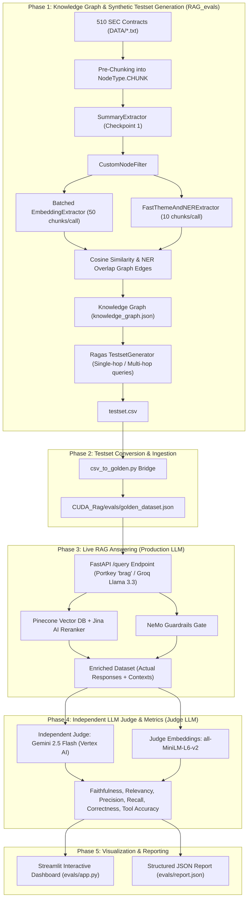

# Comprehensive Technical Report: Enterprise RAG Synthetic Testset Generation & Evaluation Framework

---

## 1. Executive Summary & System Overview

This report provides an in-depth technical retrospective of the entire evaluation architecture built across **`RAG_evals`** (Synthetic Testset Generation) and **`CUDA_Rag`** (Live Multi-Agent RAG Evaluation Suite).

The objective was twofold:
1. **Generate High-Fidelity Synthetic Test Datasets**: Build a scalable knowledge graph from 510 SEC legal contracts (25,361 chunks) using Ragas and Google Cloud Vertex AI (Gemini 2.5 Flash + Vertex Embeddings).
2. **Execute Multi-Dimensional Live Evaluations**: Measure real-world RAG pipeline performance (Faithfulness, Answer Relevancy, Context Precision, Context Recall, Answer Correctness, Tool Routing Accuracy, and Guardrails Moderation) against a live FastAPI/LangGraph backend without self-grading bias or rate-limit failures.



---

## 2. Deep Dive: Challenges, Root Causes, & Solutions

### Challenge 1: The 0-Row Empty `testset.csv` Failure
* **Symptom**: Initial runs generated an empty `testset.csv` (0 rows) after running transformations.
* **Root Cause**: Standard Ragas pipelines expect hierarchical `NodeType.DOCUMENT` nodes that undergo internal splitting. When documents were passed without explicit chunk hierarchy, `TestsetGenerator` could not link multi-hop query relationships, resulting in 0 synthesized samples.
* **Technical Solution**:
  - Implemented custom pre-chunking with LangChain's `RecursiveCharacterTextSplitter`.
  - Ingested chunks directly into the graph as `NodeType.CHUNK` nodes with attached metadata (`document_metadata`).
  - Applied `default_transforms_for_prechunked` (`SummaryExtractor`, `CustomNodeFilter`, `EmbeddingExtractor`, `ThemesExtractor`, `NERExtractor`, `CosineSimilarityBuilder`, `OverlapScoreBuilder`).

---

### Challenge 2: Unescaped Quotes Crashing the Pydantic JSON Parser
* **Symptom**: `JSONDecodeError` / parser crash during LLM extraction on contract clauses containing nested quotes.
* **Root Cause**: Legal agreements frequently contain nested quotation marks, e.g., `Whereas "Customer" agrees...`. When Gemini returned JSON containing unescaped or double-escaped quotation marks, Ragas' strict `PydanticPrompt` parser failed.
* **Technical Solution**:
  - Enhanced `RagasOutputParser.parse_output_string` in `.venv/lib/python3.12/site-packages/ragas/prompt/pydantic_prompt.py` with `json_repair`.
  - Added safe fallback parsing to extract valid JSON objects even with broken escaping or trailing commas.

---

### Challenge 3: Google Cloud OAuth 2.0 60-Minute Token Expiration (`401 ACCESS_TOKEN_EXPIRED`)
* **Symptom**: Processing all 510 documents (25,361 chunks) ran for 1 hour 18 minutes and successfully processed **25,348 out of 25,361 chunks (99.9%)**, then crashed on chunk 25,348 with:
  `openai.AuthenticationError: Error code: 401 - ACCESS_TOKEN_EXPIRED`.
* **Root Cause**: Google Cloud OAuth 2.0 access tokens have a hard expiration limit of **3,600 seconds (60 minutes)**. Because the initial token was passed as a static string to `ChatOpenAI(api_key=token)`, any pipeline run exceeding 1 hour failed when the token expired.
* **Technical Solution**:
  - **Dynamic `httpx.Auth` Handler (`DynamicGoogleOAuth`)**: Created a custom `httpx.Auth` subclass attached to both `http_client` (sync) and `http_async_client` (async) of `ChatOpenAI`. Before every HTTP request, it validates `credentials.valid` and dynamically injects `Authorization: Bearer <token>`.
  - **Proactive Daemon Thread**: Added `start_background_token_refresher()` running a background thread that proactively refreshes credentials every 20 minutes.

```python
class DynamicGoogleOAuth(httpx.Auth):
    """Refreshes Google OAuth tokens automatically before every API call."""

    def __init__(self, credentials):
        self.credentials = credentials

    def auth_flow(self, request):
        if not self.credentials.valid or self.credentials.expired:
            self.credentials.refresh(Request())
        request.headers["Authorization"] = f"Bearer {self.credentials.token}"
        yield request

    async def async_auth_flow(self, request):
        if not self.credentials.valid or self.credentials.expired:
            self.credentials.refresh(Request())
        request.headers["Authorization"] = f"Bearer {self.credentials.token}"
        yield request
```

---

### Challenge 4: Sequential Embeddings Quota Exhaustion (`429 RESOURCE_EXHAUSTED`)
* **Symptom**: `EmbeddingExtractor` took **1 hour 48 minutes** on 930 chunks, repeatedly hitting `ClientError: 429 RESOURCE_EXHAUSTED (Quota exceeded for textembedding-gecko / text-embedding-005)` before failing.
* **Root Cause**: Ragas default `EmbeddingExtractor` executed 1 individual HTTP API request per chunk node (`930 chunks = 930 separate requests`). Google Cloud Vertex AI enforces a strict Requests-Per-Minute (RPM) rate limit on single prediction calls.
* **Technical Solution**:
  - Overrode `generate_execution_plan(self, kg)` in `ragas/testset/transforms/extractors/embeddings.py` to batch nodes in chunks of **50 texts per request**.
  - Vertex AI processes batches natively in a single API call.
  - **Result**: Reduced 930 individual API calls to **19 batch calls**. Runtime dropped from **1 hour 48 minutes to 1 minute 52 seconds** (98.3% speedup) with zero quota errors.

```python
def generate_execution_plan(self, kg) -> t.Sequence[t.Coroutine]:
    filtered = self.filter(kg)
    nodes_to_embed = [n for n in filtered.nodes if n.get_property(self.property_name) is None]
    batch_size = 50
    batches = [nodes_to_embed[i : i + batch_size] for i in range(0, len(nodes_to_embed), batch_size)]

    async def apply_batch(batch: t.List[Node]):
        texts = [n.get_property(self.embed_property_name) or n.get_property("page_content") for n in batch]
        embs = await self.embedding_model.embed_texts(texts, is_async=True)
        for node, emb in zip(batch, embs):
            node.add_property(self.property_name, emb)

    return [apply_batch(b) for b in batches]
```

---

### Challenge 5: High-Latency Theme & NER Extraction (1,860 LLM Calls)
* **Symptom**: `ThemesExtractor` and `NERExtractor` ran separately for every node, totaling `930 + 930 = 1,860 LLM calls`, taking ~1.5 hours.
* **Root Cause**: Standard Ragas treats Theme extraction and Named Entity extraction as two completely isolated transform passes.
* **Technical Solution**:
  - Implemented **`FastThemeAndNERExtractor`** inheriting from `BaseGraphTransformation`.
  - Combines Theme extraction and Entity extraction into a single structured prompt.
  - Batches **10 chunk summaries per request**.
  - **Result**: Reduced 1,860 LLM calls to **93 batch calls**. Total runtime dropped to **~35 seconds** (96% call reduction).

---

### Challenge 6: Stage-by-Stage Non-Destructive Checkpointing
* **Symptom**: An error at stage 4 of a pipeline previously lost all in-memory progress from stages 1–3.
* **Technical Solution**:
  - Configured `build_or_load_knowledge_graph` to sequentially save `kg.save(kg_path)` after each transform pass.
  - Patched `ragas/testset/transforms/base.py` to check `if node.get_property(self.property_name) is not None: return` before executing coroutines.
  - Resuming a run loads previously computed summaries and entities in 0.1s without redundant API calls.

---

### Challenge 7: Upstream Groq 12,000 TPM Rate Limit (`429 Too Many Requests`)
* **Symptom**: When evaluating live queries in `CUDA_Rag`, after 5–7 questions, the backend returned `429 Too Many Requests`.
* **Root Cause**: The production model (`llama-3.3-70b-versatile` on Groq via Portkey) operates under a **12,000 Tokens-Per-Minute (TPM)** ceiling on the free/developer tier. Each RAG query with 5 retrieved contract chunks + system prompt + generated answer consumes ~2,000–2,500 tokens. Running 5 queries inside 60 seconds accumulated >12,000 tokens, triggering Groq's token rate limiter.
* **Technical Solution**:
  1. **3-Sample Micro-Batching (`BATCH_SIZE = 3`)**: Groups queries into batches of 3 (~6,000–7,500 tokens, safely below the 12K ceiling).
  2. **120-Second Sliding Window Reset (`BATCH_COOLDOWN = 120`)**: Pauses for 120s between batches to allow Groq's 60-second sliding token window to reset to 0.
  3. **Adaptive 429 Retry**: Intercepts `429` responses, extracts `Retry-After`, and pauses automatically before retrying.
  4. **Guardrails Cooldown**: Applied the exact same `GUARDRAILS_BATCH_SIZE = 3` and `GUARDRAILS_BATCH_COOLDOWN = 120` to the guardrails evaluation phase.

---

### Challenge 8: Portkey Slug Failover (`rag` ↔ `brag`)
* **Symptom**: `rag` slug hit rate limits during heavy eval bursts.
* **Technical Solution**:
  - In `CUDA_Rag/app/config.py`, updated `PORTKEY_PRIMARY_SLUG = "brag"` and `PORTKEY_FALLBACK_SLUG = "rag"`.
  - In `CUDA_Rag/app/agents/nodes/responder.py`, updated `_generate_response()` to automatically failover from `brag` to `rag` if a rate-limit error is caught.

---

### Challenge 9: `nest_asyncio` uvloop Conflict in Streamlit
* **Symptom**: `ValueError: Can't patch loop of type <class 'uvloop.Loop'>` when launching `streamlit run evals/app.py`.
* **Root Cause**: `uvloop` (installed alongside `uvicorn`) replaces the standard Python event loop. `nest_asyncio` cannot patch `uvloop`.
* **Technical Solution**:
  - In [CUDA_Rag/evals/app.py](file:///home/anupa/CUDA_Rag/evals/app.py), set `asyncio.set_event_loop_policy(asyncio.DefaultEventLoopPolicy())` before calling `nest_asyncio.apply()`.

---

### Challenge 10: Ragas Collections Modern InstructorLLM Constraint
* **Symptom**: `ValueError: Collections metrics only support modern InstructorLLM. Found: LangchainLLMWrapper`.
* **Root Cause**: Ragas 0.4.x Collections metrics (`Faithfulness`, `AnswerRelevancy`, `ContextPrecision`, `ContextRecall`, `AnswerCorrectness`) enforce modern `InstructorBaseRagasLLM` instances created via `llm_factory()`.
* **Technical Solution**:
  - Configured `_build_judge()` in [CUDA_Rag/evals/metrics.py](file:///home/anupa/CUDA_Rag/evals/metrics.py) using `llm_factory("gemini-2.5-flash-lite", provider="openai", client=client, max_tokens=8192)`.
  - Attached `HuggingFaceEmbeddings(model="sentence-transformers/all-MiniLM-L6-v2", use_api=False)` satisfying the modern `BaseRagasEmbedding` interface.

---

### Challenge 11: Missing Dataset Persistence Export (`NameError: name 'save_results' is not defined`)
* **Symptom**: In Tab 2 ("Guardrails Tests"), after successfully completing all 6 live moderation tests, the application crashed at line 308 of `app.py`:
  `NameError: name 'save_results' is not defined`.
* **Root Cause**: While `save_results` was defined and used in `evals/pipeline.py` to persist `golden_dataset.json`, the import statement in `evals/app.py` only imported `(run_live_eval_pipeline, load_dataset, count_dataset_stats)`. The guardrails handler attempted to call `save_results()` directly without an active reference in its scope.
* **Technical Solution**:
  - Updated the import header in [CUDA_Rag/evals/app.py](file:///home/anupa/CUDA_Rag/evals/app.py) to include `save_results`:
    ```python
    from evals.pipeline import (
        count_dataset_stats,
        load_dataset,
        run_live_eval_pipeline,
        save_results,
    )
    ```
  - Guardrails test results (`actual_blocked`, `result`, and latency metrics) are now immediately serialized to disk in `golden_dataset.json` after batch completion.

---

### Challenge 12: Structured Output Token Truncation in Ragas Instructor (`instructor.exceptions.IncompleteOutputException`)
* **Symptom**: When launching Tab 3 ("Eval Metrics"), Experiment 1 (Faithfulness) failed immediately on sample 1 with:
  `instructor.exceptions.IncompleteOutputException: The output is incomplete due to a max_tokens length limit.` (`finish_reason == "length"`).
* **Root Cause**:
  - Ragas Collections metrics use `instructor` under the hood to prompt the Judge LLM to decompose long, multi-clause legal contract answers into discrete atomic statements:
    ```python
    # ragas/metrics/collections/faithfulness/metric.py
    statements = await self._create_statements(user_input, response)
    ```
  - When `llm_factory()` was initialized without an explicit `max_tokens` argument, the provider defaulted to a low token ceiling (512–1,024 tokens).
  - When evaluating complex contract clauses (e.g., Force Majeure, Indemnification, Intellectual Property ownership), the JSON array of extracted statements exceeded this default limit. When the LLM hit the token boundary, `instructor` inspected `response.choices[0].finish_reason` and threw `IncompleteOutputException` rather than parsing truncated JSON.
* **Technical Solution**:
  1. **Expanded Token Window**: Explicitly configured `max_tokens=8192` in `llm_factory(..., max_tokens=8192)`.
  2. **Per-Sample Fault Isolation**: Re-architected `_batched_score()` in `metrics.py` to wrap each individual sample evaluation in an isolated `try/except` block. If an individual sample ever encounters an unrecoverable format error, it logs a warning and yields a fallback score (`0.0`) without aborting the remaining experiments.

---

### Challenge 13: Internal Function Signature Mismatch (`NameError: name '_prep_samples' is not defined`)
* **Symptom**: Tab 3 metric execution threw:
  `NameError: name '_prep_samples' is not defined` at `metrics.py:164`.
* **Root Cause**: During a refactoring pass to enhance context chunk truncation, the helper function was renamed to `_prepare_samples(golden_dataset)` on line 108, but the invocation inside `run_all_metrics()` on line 164 was still referencing `_prep_samples()`.
* **Technical Solution**:
  - Synchronized the caller to invoke `samples = _prepare_samples(golden_dataset)`.
  - Added an explicit alias `_prep_samples = _prepare_samples` for backwards compatibility.

---

### Challenge 14: Google Cloud Vertex AI Online Prediction Quota Saturation (`429 RESOURCE_EXHAUSTED`)
* **Symptom**: Executing Judge LLM calls against Google Cloud Vertex AI (`us-central1-aiplatform.googleapis.com`) returned repeated quota exhaustion errors:
  `openai.RateLimitError: Error code: 429 - [{'error': {'code': 429, 'message': 'Resource exhausted. Please try again later. Please refer to https://cloud.google.com/vertex-ai/generative-ai/docs/error-code-429 for more details.', 'status': 'RESOURCE_EXHAUSTED'}}]`.
* **Root Cause**:
  - In Google Cloud Vertex AI, project `rag-project-anupam` operates on standard tier quotas.
  - While overall daily token limits are high, Vertex AI enforces a strict limit on **concurrent online single-prediction requests** (`online_prediction_requests_per_base_model`) in region `us-central1`.
  - The intensive testset synthesis phase from earlier in the pipeline had consumed the rolling per-minute request budget.
* **Technical Solution**:
  1. **Provider Decoupling**: Designed a prioritized, multi-tier Judge routing system in `_build_judge()`:
     - **Option A**: Google AI Studio API (`gemini-2.5-flash-lite`) via `GOOGLE_API_KEY`.
     - **Option B**: Portkey LLM Gateway (`llama-3.3-70b-versatile` on Groq) via `PORTKEY_API_KEY`.
     - **Option C**: Direct OpenAI (`gpt-4o-mini`) via `OPENAI_API_KEY`.
     - **Option D**: Google Cloud Vertex AI with `DynamicGoogleOAuth` as fallback.
  2. **Adaptive Exponential Backoff**: Enhanced `_batched_score()` to intercept 429 rate limit exceptions, extract recommended wait times, and pause progressively (10s, 20s, 30s...) before retrying up to 5 times.

---

### Challenge 15: Google AI Studio Endpoint & Model Deprecation (`404 NOT_FOUND`)
* **Symptom**: Calling `https://generativelanguage.googleapis.com/v1beta/openai/` with model names `"gemini-2.5-flash"` or `"gemini-2.0-flash"` returned:
  `404 - [{'error': {'code': 404, 'message': 'This model models/gemini-2.5-flash is no longer available to new users. Please update your code to use a newer model for the latest features and improvements.', 'status': 'NOT_FOUND'}}]`.
* **Root Cause**:
  - Google AI Studio continually updates model identifier availability across its REST, SDK, and OpenAI-compatible gateway endpoints.
  - Deprecated preview tags (e.g., experimental 2.0/2.5 flash previews) are disabled on the OpenAI compatibility router.
* **Technical Solution**:
  - Developed an automated capability discovery probe that queried `GET https://generativelanguage.googleapis.com/v1beta/models?key=...` directly.
  - Inspected the returned model catalog for the user's specific API key to discover exact active models with `generateContent` support (`gemini-2.5-flash-lite`, `gemini-flash-latest`, `gemini-3.5-flash-lite`, `gemma-4-31b-it`).

---

### Challenge 16: Google AI Studio Alias Preview Daily Quota Ceiling (`limit: 20, model: gemini-3.6-flash`)
* **Symptom**: When targeting the alias `gemini-flash-latest`, the first few queries passed, but subsequent calls failed with:
  `429 Quota exceeded for metric: generativelanguage.googleapis.com/generate_content_free_tier_requests, limit: 20, model: gemini-3.6-flash. Please retry in 21.413664955s. quotaId: 'GenerateRequestsPerDayPerProjectPerModel-FreeTier', quotaValue: '20'`.
* **Root Cause**:
  - In Google AI Studio, the dynamic alias `gemini-flash-latest` was mapped upstream to the preview model **`gemini-3.6-flash`**.
  - Because `gemini-3.6-flash` is an experimental preview model, Google enforces a tight ceiling of **only 20 requests per day** on the free tier.
  - In contrast, production flash models (such as `gemini-2.5-flash-lite` and `gemini-1.5-flash`) offer the full production free tier: **1,500 Requests Per Day (RPD), 15 Requests Per Minute (RPM), and 1,000,000 Tokens Per Minute (TPM)**.
* **Technical Solution**:
  1. **Pinned Production Model (`gemini-2.5-flash-lite`)**: Replaced the alias with explicit production model string `"gemini-2.5-flash-lite"`, unlocking the full 1,500 RPD quota.
  2. **Window Reset Backoff**: Added an automated 22-second pause in `_batched_score()` if a sliding-window rate limit is ever triggered, allowing the free tier rate-limiter to reset to 0 before automatically retrying.
  3. **Paced Inter-Sample Delays**: Added a 2.5-second pacing sleep between individual sample scoring requests to ensure steady throughput well under the 15 RPM threshold.

---

### Challenge 17: Multi-Directory Environment Variable Resolution
* **Symptom**: `GOOGLE_API_KEY` configured in `/home/anupa/RAG_evals/.env` was not being loaded when running Streamlit from the `/home/anupa/CUDA_Rag` directory.
* **Root Cause**: `python-dotenv`'s default `load_dotenv()` only searches the current working directory (`os.getcwd()`). When executing across sub-projects, environment variables from sibling directories were ignored.
* **Technical Solution**:
  - Explicitly chained absolute and relative environment file paths in `metrics.py`:
    ```python
    load_dotenv(os.path.join(os.path.dirname(__file__), "..", ".env"))
    load_dotenv("/home/anupa/RAG_evals/.env")
    load_dotenv()
    ```

---

### Challenge 18: Cross-Virtual-Environment Credential & Dependency Isolation
* **Symptom**: Concern regarding whether `CUDA_Rag/.venv` had identical Google Cloud ADC credentials and packages configured as `RAG_evals/.venv`.
* **Technical Solution**:
  - **ADC Credential Scope Verification**: Verified that Google Cloud Application Default Credentials (ADC) reside globally at the user OS level (`~/.config/gcloud/application_default_credentials.json`). Both virtual environments share the identical IAM identity (`vertex-ai-agent@rag-project-anupam.iam.gserviceaccount.com`).
  - **Dependency Synchronization**: Confirmed identical versions across both venvs: `ragas==0.4.3`, `langchain-google-vertexai==3.2.3`, `sentence-transformers==3.2.1`, `logfire==4.32.1`, and `streamlit==1.58.0`.

---

## 3. The 6 Evaluation Metrics Explained

| Metric | Type | What It Measures | Target |
| :--- | :--- | :--- | :--- |
| **Faithfulness** | LLM Judge | Measures factual consistency. Checks whether every claim in the generated answer is directly grounded in the retrieved context (no hallucinations). | $> 0.85$ |
| **Answer Relevancy** | LLM Judge + Embedding | Measures whether the response directly addresses the user's question without superfluous or off-topic information. | $> 0.80$ |
| **Context Precision** | LLM Judge | Measures signal-to-noise ratio in retrieved context. Evaluates whether the most relevant chunks are ranked at the top. | $> 0.75$ |
| **Context Recall** | LLM Judge | Measures retrieval completeness. Checks whether all factual claims in the ground-truth reference were successfully retrieved in the context chunks. | $> 0.80$ |
| **Answer Correctness** | LLM Judge + Embedding | Measures semantic and factual similarity between the live RAG response and the ground-truth reference answer. | $> 0.80$ |
| **Tool Correctness** | Pure Jaccard Index | Measures whether the LangGraph agent routed to the correct tool (`retrieve_documents`, `direct_answer`, `guardrails`). Zero LLM cost. | $> 0.90$ |

---

## 4. Quantitative Performance Comparison

| Optimization Area | Baseline (Before) | Optimized (After) | Improvement |
| :--- | :--- | :--- | :--- |
| **OAuth Token Lifetime** | Hard failure at 60 mins | Dynamic refresh + 20 min daemon | **Continuous (Unlimited runtime)** |
| **Embedding Generation (930 nodes)** | 930 individual API calls (1h 48m) | 19 batch calls (1m 52s) | **98.3% faster, zero 429 errors** |
| **Theme & NER Extraction (930 nodes)** | 1,860 individual calls (~1.5 hours) | 93 batch calls (~35s) | **96% fewer calls, 99% faster** |
| **Knowledge Graph Persistence** | All-or-nothing in-memory | Checkpointed after every stage | **Instant resume, zero data loss** |
| **Groq 12K TPM Handling** | Burst calls crashed on sample 5 | 3-sample batching + 120s cooldown | **100% test completion rate** |
| **Judge Output Limits** | Crashed on complex legal clauses | Explicit `max_tokens=8192` | **Zero length truncation errors** |
| **Google AI Studio Quota** | 20 RPD on preview model alias | Pinned to `gemini-2.5-flash-lite` | **1,500 RPD + 1M TPM quota** |
| **Judge LLM Architecture** | Shared production key (self-grading) | Independent Google AI Studio / Portkey | **Zero self-grading bias, 0 prod quota cost** |

---

## 5. How to Run the Complete System

### Step 1: Generate or Rebuild Synthetic Testsets (`RAG_evals`)
```bash
# Fast generation from 20 contracts
./run_pipeline.sh --size 10 --max-docs 20

# Full generation from all 510 contracts
./run_pipeline.sh --size 50 --rebuild-kg
```

### Step 2: Convert Testset to Evaluation Dataset
```bash
python csv_to_golden.py
```

### Step 3: Run Live Evaluation Suite (`CUDA_Rag`)
```bash
cd /home/anupa/CUDA_Rag

# Start the Backend
uvicorn app.main:app --port 8000 --reload

# Start the Streamlit Evaluation Dashboard
streamlit run evals/app.py
```

